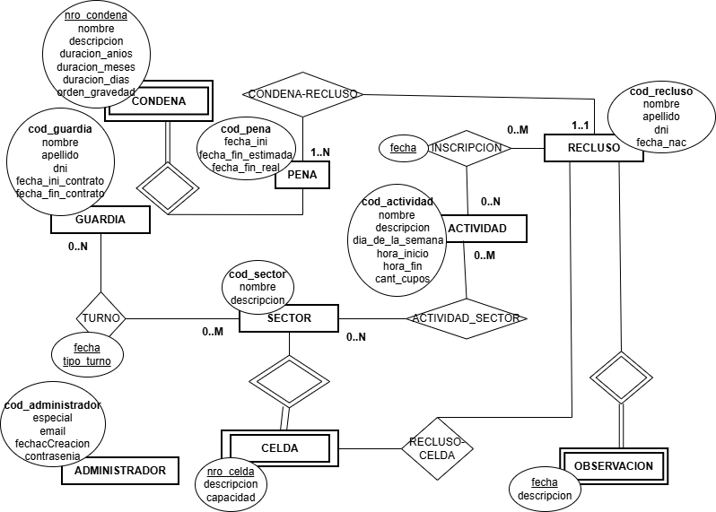

# Propuesta TP DSW

### Integrantes

- 50670 - Chaparro, Ignacio

### Repositorios

- [frontend app](https://github.com/wickyWalk32/Libertant-Front)
- [backend app](https://github.com/wickyWalk32/Libertant-Back)

## Tema

### Descripción

Libertant es una aplicación web para gestion carcelaria. Tanto para llevar un control de los guardias y sus turnos como de los reclusos

### Modelo

